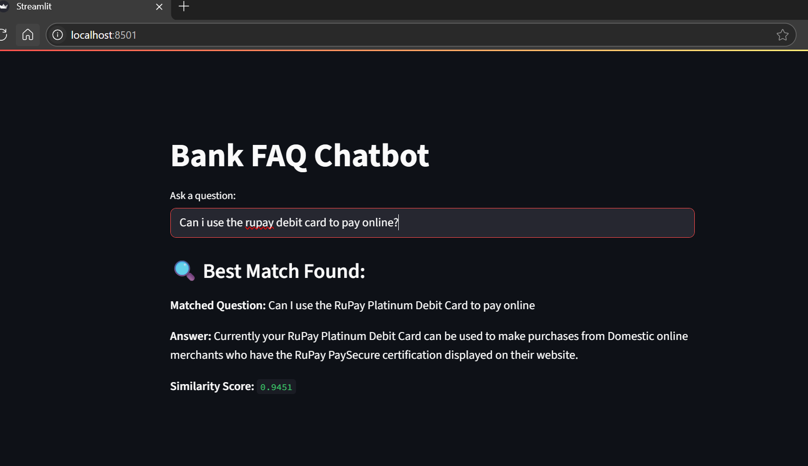
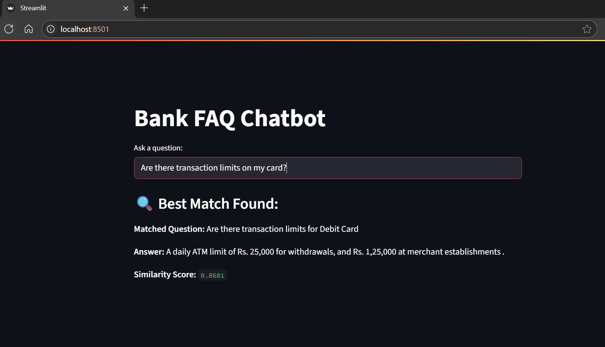
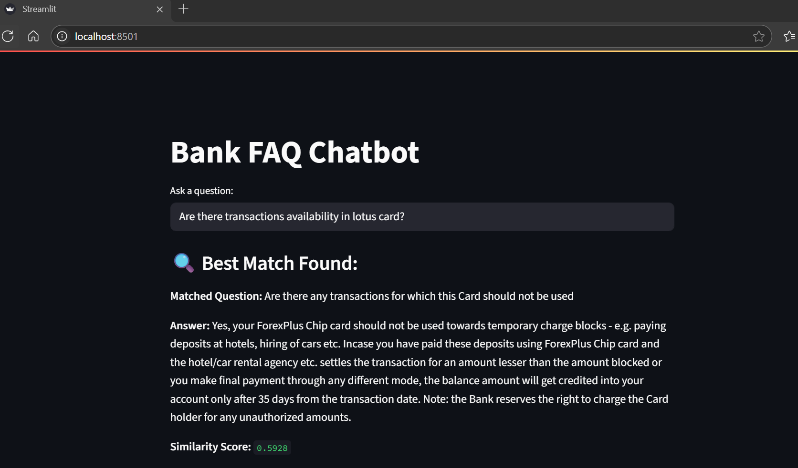
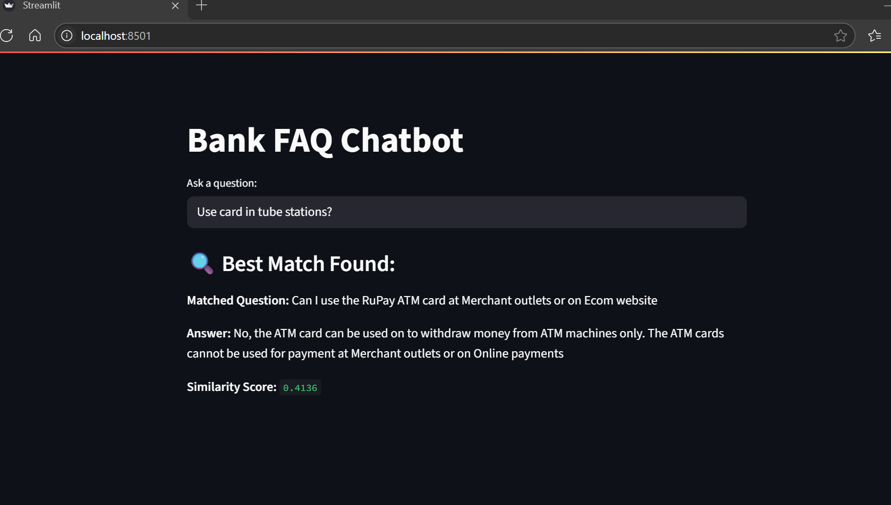

# 💬 Bank FAQ Chatbot

This is a simple chatbot that answers customer queries using a local semantic search over bank FAQs. It uses SentenceTransformers for embedding and Streamlit for a lightweight web interface.

---

## 🚀 Features

- Embeds and stores FAQs locally using `all-MiniLM-L6-v2` (384-dim) model.
- Performs semantic similarity search using cosine similarity.
- First attempts to match query with question embeddings.
- Falls back to question+answer (combined) embeddings if similarity < 0.5.
- Clean and interactive UI built with Streamlit.

---

## 📁 Project Structure

├── BankFAQs.csv # Raw FAQ data (questions & answers)
├── bankfaqs_with_local_embeddings.pkl # Generated embeddings using the miniLM model(to discourage reuse)
├── streamlit_app.py # Streamlit UI app
├── generate_embeddings.ipynb # Jupyter notebook to embed FAQ records
├── requirements.txt # Dependencies
└── README.md # Project documentation

## How to Run

1. Clone the repository:
   ```bash
   git clone https://github.com/your-username/bankfaq.git
   cd bankfaq
2. Install dependencies
    pip install -r requirements.txt
3. Run the App
    streamlit run streamlit_app.py

## Dataset

Special thanks to JayPatel for the BankFAQ.csv.
https://github.com/MrJay10

## Screenshots!

When there is high similarity between the query and Question




When there is low similarity (Combined) is used
